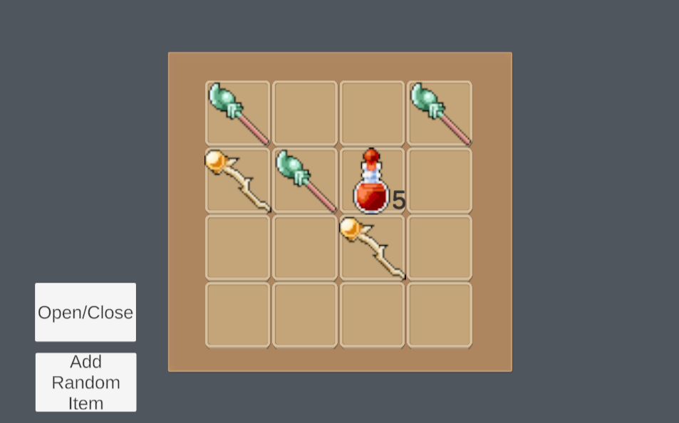

# Unity 2D Inventory System Demo

This Unity project serves as a demonstration of a simple and versatile 2D inventory system. It is not intended to be a fully-fledged game but rather showcases the functionality and mechanics of the inventory system. The project's main purpose is to provide developers with a practical example of implementing an inventory system in their games or applications.

## Key Features

- **Resolution Support:** The inventory system has been designed to adapt to most 16:9 resolutions, ensuring a consistent and responsive user experience across different screen sizes.

- **Add Items to Inventory:** You can easily add items to the inventory by clicking the "Add Random Item" button. Observe how items are organized and managed in the inventory grid.
  
- **Swap Items:** To further manage your inventory, you can swap items between slots. Simply drag an item from one slot to another to perform the swap.

- **Split Stacks of Items:** You have the option to split stacks of items in the inventory. Use the middle mouse button to split a stack in half, or use the right mouse button to specify a custom split quantity.

- **Open and Close Inventory:** The inventory can be accessed and closed using the "Open/Close" button. Experience the smooth and intuitive user interface for managing your items.

- **Scriptable Objects:** The project makes extensive use of Unity's Scriptable Objects to facilitate data-driven design, making it easier to create, modify, and manage items in the inventory.

- **Unity TextMeshPro:** The project utilizes TextMeshPro for handling rich text and enhanced typography, providing an aesthetically pleasing UI.

## Preview

## How to Use

1. Clone or download the repository to your local machine.

2. Open the project in Unity 2022.3.2f1.

3. Explore the scene titled "InventoryDemo" to interact with the inventory system.

4. Play the scene and utilize the "Add Random Item" button to add items to your inventory.

5. To swap items, click and drag an item from one slot to another in the inventory grid.

6. To split stacks of items, use the middle mouse button to split a stack in half or the right mouse button to specify a custom split quantity.

7. Use the "Open/Close" button to manage the visibility of the inventory panel.

## GitHub Pages

The project is hosted on GitHub Pages, allowing you to access a live demo of the inventory system. Visit the [Unity 2D Inventory System Demo](https://guirosaalves.github.io/InventorySystem) to experience the functionality firsthand.

## Latest Release

For the most stable version of the project, check out the [latest release](https://github.com/GuiRosaAlves/InventorySystem/releases/latest).

## Contact

If you have any questions, suggestions, or feedback, feel free to reach out to us:

- Email: [guilhermerosaalves@gmail.com](mailto:guilhermerosaalves@gmail.com)
- Twitter: [GuiRosaAlves](https://www.linkedin.com/in/guirosaalves/)

## Dependencies

- Unity TextMeshPro: The project utilizes TextMeshPro for handling rich text and enhanced typography. Make sure you have TextMeshPro installed in your Unity project.

## License

This project is licensed under the MIT License - see the [LICENSE](LICENSE) file for details.

## Acknowledgments

Special thanks to the Unity community for their invaluable resources and tutorials on inventory system implementation.
